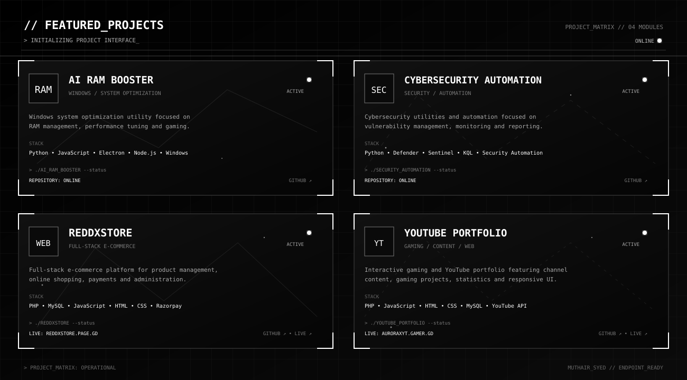

<!-- ============================= -->
<!--        CYBER HEADER            -->
<!-- ============================= -->

  

<!-- ============================= -->
<!--       PROFILE STATUS           -->
<!-- ============================= -->

  
  

  

  

## Featured Projects

  

